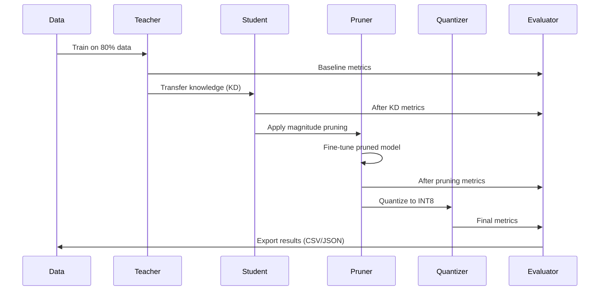

# Full Compression Pipeline Documentation

## Overview

The `kd_prune_quant` pipeline is a comprehensive model compression framework that reduces model size while maintaining performance through a multi-stage process: **Knowledge Distillation (KD) → Pruning → Quantization**.


---

## Pipeline Execution Flow

### Phase 0: Initialization & Data Preparation

#### Configuration Loading
```python
config = parse_args_and_get_config()
```

**What happens:**
- Parses command-line arguments
- Sets pipeline-specific defaults based on `--pipeline` flag
- Configures device (GPU/CPU) selection
- Initializes output directories

#### Dataset Loading & Preprocessing
```python
df = load_dataset(config.dataset_path)
```

**Steps:**
1. **Load CSV**: Reads hate speech dataset from `data/HateSpeech.csv`
2. **Column Mapping**: Renames `Comments` → `comment` for consistency
3. **Data Cleaning**: Drops rows with missing values
4. **Subsampling**: If `data_fraction < 1.0`, randomly samples subset (e.g., 5% = 820 samples from 16,407)
5. **Label Analysis**: Computes class distribution (e.g., 50.7% positive for HateSpeech)

#### Tokenization
```python
tokenized_data = load_or_tokenize_data(df, teacher_tokenizer, student_tokenizer)
```

**Dual Tokenization Strategy:**
- **Teacher tokens**: `csebuetnlp/banglabert` tokenizer → stored as `input_ids`, `attention_mask`
- **Student tokens**: `distilbert-base-multilingual-cased` tokenizer → stored as `student_input_ids`, `student_attention_mask`
- **Caching**: Saves tokenized data to `./cache/` for reuse
- **Max Length**: 128 tokens (configurable)

#### Data Splitting
```python
train_idx, val_idx = create_folds(tokenized_data, num_folds=1)
```

**Split Strategy:**
- If `num_folds=1`: Simple 80/20 train/validation split
- If `num_folds>1`: K-fold cross-validation
- **Class Weights**: Computed for handling imbalanced data

---

### Phase 1: Teacher Model Training

```python
teacher, tokenizer, teacher_metrics = get_or_train_teacher(
    config, tokenized_data, train_idx, val_idx, device
)
```

#### Model Architecture
- **Base Model**: `csebuetnlp/banglabert` (BERT-based)
- **Classifier Head**: Binary classification layer for hate speech detection
- **Parameters**: ~110M parameters
- **Size**: ~420 MB

#### Training Process

**Optimizer Configuration:**
```python
optimizer = AdamW(teacher.parameters(), lr=2e-5, weight_decay=0.01)
scheduler = LinearScheduleWithWarmup(warmup_ratio=0.1)
```

**Training Loop (per epoch):**
1. **Forward Pass**: 
   - Input: `input_ids`, `attention_mask` (teacher tokenization)
   - Output: Logits for binary classification
   
2. **Loss Calculation**:
   ```python
   loss = BCEWithLogitsLoss(pos_weight=class_weights)(logits, labels)
   ```
   - Uses class weights to handle imbalance
   
3. **Backward Pass**:
   - Gradient computation
   - Gradient clipping (norm=1.0)
   - Parameter update
   
4. **Validation**:
   - Computes F1 score on validation set
   - Tracks best F1 for early stopping

#### Metric Collection (Best Epoch)

When validation F1 improves:
```python
# Evaluate on training subset (first 2000 samples)
train_subset_loader = create_data_loaders(train_idx[:2000])
train_preds, train_labels = evaluate(train_subset_loader)

# Calculate detailed metrics
train_accuracy = accuracy_score(train_labels, train_preds)
train_precision_hate = precision_score(pos_label=1)
train_recall_hate = recall_score(pos_label=1)
train_f1_hate = f1_score(pos_label=1)
# ... same for non-hate class
train_roc_auc = roc_auc_score(train_labels, train_probs)

# Calculate validation loss
val_loss = BCEWithLogitsLoss()(val_outputs, val_labels)
```

**Stored Metrics:**
- `best_epoch`: Epoch number with best validation F1
- `val_loss`: Validation loss at best epoch
- `train_accuracy`, `train_loss`: Training performance
- Per-class metrics for "Hate" and "Non-Hate"

#### Baseline Evaluation
```python
baseline_metrics = evaluator.evaluate_model(
    teacher, val_loader, device, 
    stage='baseline',
    extra_metrics=teacher_metrics
)
```

**Computed Metrics:**
- **Classification**: F1 (macro/weighted), accuracy, precision, recall
- **Model Size**: Parameters, disk size, sparsity
- **Efficiency**: Latency, throughput
- **Training Metrics**: From `teacher_metrics` dict

---

### Phase 2: Knowledge Distillation (KD)

```python
student, kd_train_metrics = run_knowledge_distillation(
    config, teacher, tokenized_data, train_idx, val_idx, device
)
```

#### Purpose
Transfer knowledge from large teacher (110M params) to smaller student (135M params, but different architecture).

> **Note**: In this case, student has more parameters but uses a different architecture (DistilBERT) that's more efficient.

#### Model Setup

**Teacher Wrapper:**
```python
teacher_model = TeacherModel(teacher)
teacher_model.eval()  # Frozen, no gradient updates
```

**Student Model:**
```python
student_model = StudentModel('distilbert-base-multilingual-cased')
# Parameters: ~135M
# Layers: 6 transformer layers (vs 12 in BERT)
```

#### Distillation Loss

**Combined Loss Function:**
```python
loss = alpha * soft_loss + (1 - alpha) * hard_loss
```

**Components:**

1. **Soft Loss (Logit Distillation)**:
   ```python
   soft_loss = KLDivergence(
       student_logits / temperature,
       teacher_logits / temperature
   ) * (temperature ** 2)
   ```
   - `temperature=4.0`: Softens probability distributions
   - `alpha=0.7`: Weight for soft loss (70%)
   - Teaches student to mimic teacher's predictions

2. **Hard Loss (Ground Truth)**:
   ```python
   hard_loss = BCEWithLogitsLoss(student_logits, true_labels)
   ```
   - `(1-alpha)=0.3`: Weight for hard loss (30%)
   - Ensures student learns actual labels

3. **Hidden Layer Alignment** (Optional):
   ```python
   hidden_loss = cosine_similarity(student_hidden, teacher_hidden)
   ```
   - Aligns intermediate representations
   - Maps student layers to teacher layers

#### Training Process

**Per Epoch:**
1. **Teacher Forward Pass** (no gradients):
   ```python
   with torch.no_grad():
       teacher_outputs = teacher(input_ids, attention_mask)
       teacher_logits = teacher_outputs['logits']
       teacher_hidden = teacher_outputs['hidden_states']
   ```

2. **Student Forward Pass**:
   ```python
   student_outputs = student(student_input_ids, student_attention_mask)
   student_logits = student_outputs['logits']
   student_hidden = student_outputs['hidden_states']
   ```

3. **Loss Calculation**:
   ```python
   losses = distillation_loss(
       student_logits, teacher_logits,
       student_hidden, teacher_hidden,
       labels
   )
   total_loss = losses['soft_loss'] + losses['hard_loss'] + losses['hidden_loss']
   ```

4. **Backward Pass**:
   - Only student parameters updated
   - Teacher remains frozen

5. **Validation & Metric Collection**:
   - Same as teacher training
   - Tracks best epoch and detailed metrics

#### KD Evaluation
```python
kd_metrics = evaluator.evaluate_model(
    student, val_loader, device,
    stage='after_kd',
    use_student_input_ids=True,  # Use student tokenization
    extra_metrics=kd_train_metrics
)
```

**Expected Changes:**
- Size: May increase (135M vs 110M params)
- F1: Slight drop (0.713 → 0.652 in test)
- Latency: Improved (70ms → 37ms)
- Throughput: Improved (114 → 218 samples/sec)

---

### Phase 3: Pruning

```python
pruned_model, prune_train_metrics = run_pruning(
    config, student, tokenized_data, train_idx, val_idx, device,
    model_name='student'
)
```

#### Purpose
Remove redundant weights to reduce model size and improve inference speed.

#### Pruning Strategy: Magnitude-Based

**Initialization:**
```python
pruner = PruningManager(
    model=student,
    target_sparsity=0.5,  # Remove 50% of weights
    prune_layers='all',
    global_pruning=True
)
```

**Process:**
1. **Weight Ranking**:
   ```python
   # For each layer
   weights = layer.weight.data
   importance = abs(weights)  # Magnitude-based
   threshold = percentile(importance, target_sparsity)
   ```

2. **Mask Creation**:
   ```python
   mask = (importance > threshold).float()
   # 1 = keep weight, 0 = prune weight
   ```

3. **Apply Pruning**:
   ```python
   pruner.apply_magnitude_pruning()
   # Creates binary masks for each layer
   ```

4. **Make Permanent**:
   ```python
   pruner.make_pruning_permanent()
   # Applies masks to weights: weight = weight * mask
   ```

**Initial Impact:**
- F1 drops significantly (0.646 → 0.198)
- Sparsity: ~16% (actual) vs 50% (target)
- Model still functional but degraded

#### Fine-Tuning After Pruning

**Purpose**: Recover accuracy lost during pruning

**Configuration:**
```python
optimizer = AdamW(
    model.parameters(),
    lr=config.lr * 0.1,  # 10x lower learning rate
    weight_decay=config.weight_decay
)
```

**Training Loop:**
1. **Forward Pass** (with pruned weights)
2. **Loss Calculation**: Standard BCE loss
3. **Backward Pass**: Updates non-pruned weights only
4. **Metric Tracking**: Same as previous stages

**Per Epoch Metric Collection:**
```python
# When validation F1 improves
train_preds, train_labels = evaluate_subset(first_50_batches)
# Calculate all detailed metrics
# Store in best_metrics dict
```

**Recovery:**
- F1 recovers (0.198 → 0.633)
- Sparsity: ~0.8% (many weights reactivated during fine-tuning)

#### Pruning Evaluation
```python
prune_metrics = evaluator.evaluate_model(
    pruned_model, val_loader, device,
    stage='after_pruning',
    use_student_input_ids=True,
    extra_metrics=prune_train_metrics
)
```

**Expected Changes:**
- Size: Same (sparsity doesn't reduce file size without compression)
- F1: Slight recovery (0.652 → 0.633 after fine-tuning)
- Latency: Similar (37ms → 37ms)

---

### Phase 4: Quantization

```python
quantized_model, quant_device = run_quantization(
    config, pruned_model, tokenized_data, train_idx, val_idx, device
)
```

#### Purpose
Reduce precision of weights from FP32 (32-bit) to INT8 (8-bit) to reduce model size.

#### Quantization Method: Dynamic

**Process:**
```python
quantized_model = torch.quantization.quantize_dynamic(
    model,
    {torch.nn.Linear},  # Quantize linear layers only
    dtype=torch.qint8
)
```

**What Happens:**
1. **Weight Quantization**:
   ```python
   # For each linear layer
   fp32_weight = layer.weight  # 32-bit float
   scale = (max(weight) - min(weight)) / 255
   zero_point = -min(weight) / scale
   int8_weight = round(fp32_weight / scale + zero_point)
   ```

2. **Activation Quantization** (Dynamic):
   - Computed at runtime based on input range
   - No calibration data needed

3. **Dequantization for Computation**:
   ```python
   # During inference
   fp32_output = (int8_weight - zero_point) * scale
   ```

**Device Constraint:**
- Quantized models run on **CPU only** (PyTorch limitation)
- Model moved from GPU to CPU

#### Size Reduction

**Calculation:**
```python
original_size = 514.73 MB
quantized_size = 351.82 MB
compression_ratio = original_size / quantized_size = 1.46×
size_reduction = (1 - quantized_size/original_size) * 100 = 31.6%
```

**Why not 4× reduction?**
- Only linear layers quantized (not embeddings, layer norms)
- Metadata and model structure remain FP32
- Actual reduction: ~32%

#### Quantization Evaluation
```python
quant_metrics = evaluator.evaluate_model(
    quantized_model, val_loader, quant_device,  # CPU device
    stage='after_quantization'
    # No extra_metrics - no training involved
)
```

**Expected Changes:**
- Size: Reduced (515MB → 352MB)
- F1: Slight change (0.633 → 0.651)
- Latency: **Increased** (37ms → 272ms) - CPU slower than GPU
- Throughput: **Decreased** (217 → 29 samples/sec)

> **Note**: In production, quantized models are faster on CPU than FP32, but slower than GPU inference.

---

## Evaluation at Each Stage

### CompressionEvaluator

**Purpose**: Comprehensive metric collection at each pipeline stage

#### Metrics Computed

**1. Model Size Metrics:**
```python
size_mb = os.path.getsize(model_path) / (1024 ** 2)
params_M = sum(p.numel() for p in model.parameters()) / 1e6
sparsity = count_zeros(model.parameters()) / total_params
compression = baseline_size / current_size
```

**2. Classification Metrics:**
```python
# Inference on validation set
predictions = []
labels = []
for batch in val_loader:
    outputs = model(batch['input_ids'], batch['attention_mask'])
    preds = sigmoid(outputs['logits']) > 0.5
    predictions.extend(preds)
    labels.extend(batch['labels'])

# Compute metrics
f1_macro = f1_score(labels, predictions, average='macro')
f1_weighted = f1_score(labels, predictions, average='weighted')
accuracy = accuracy_score(labels, predictions)
precision = precision_score(labels, predictions)
recall = recall_score(labels, predictions)
```

**3. Efficiency Metrics:**
```python
# Latency measurement
latencies = []
for batch in val_loader:
    start = time.time()
    outputs = model(batch)
    latencies.append(time.time() - start)

latency_ms = mean(latencies) * 1000
throughput = batch_size / (latency_ms / 1000)
speedup = baseline_latency / current_latency
```

**4. Training Metrics** (from `extra_metrics`):
```python
if extra_metrics:
    metrics.best_epoch = extra_metrics.get('best_epoch')
    metrics.val_loss = extra_metrics.get('val_loss')
    metrics.train_accuracy = extra_metrics.get('train_accuracy')
    metrics.train_f1_hate = extra_metrics.get('train_f1_hate')
    # ... all other training metrics
```

### Output Files

**1. Stage-Specific CSV:**
```
./compressed_models/results_baseline.csv
./compressed_models/results_after_kd.csv
./compressed_models/results_after_pruning.csv
./compressed_models/results_after_quantization.csv
```

**2. Final Summary:**
```
./compressed_models/results_final.csv
./compressed_models/results_final.json
```

**Format:**
```csv
stage,size_mb,params_M,sparsity_%,f1_macro,best_epoch,val_loss,train_accuracy,...
baseline,420.48,110.22,0.0,0.713,1,0.635,0.788,...
after_kd,514.73,134.93,0.0,0.652,1,0.636,0.678,...
after_pruning,514.73,134.93,0.008,0.682,1,0.669,0.680,...
after_quantization,351.82,92.23,0.0,0.646,,,,...
```

---

## Model Saving

### HuggingFace Format

**At each stage:**
```python
save_model_hf_format(model, tokenizer, output_dir, stage_name)
```

**Files Created:**
```
./compressed_models/model_{stage}_hf/
├── config.json              # Model architecture config
├── model.safetensors        # Model weights (safe format)
├── tokenizer.json           # Fast tokenizer
├── tokenizer_config.json    # Tokenizer settings
├── special_tokens_map.json  # Special token mappings
├── vocab.txt                # Vocabulary
├── classifier_config.json   # Classification head config
├── classifier.pt            # Classification head weights
└── how_to_load.py          # Loading instructions
```

**Loading Example:**
```python
from transformers import AutoTokenizer, AutoModel
import torch

tokenizer = AutoTokenizer.from_pretrained('./model_after_kd_hf')
model = AutoModel.from_pretrained('./model_after_kd_hf')
classifier = torch.load('./model_after_kd_hf/classifier.pt')
```

---

## Summary: Complete Pipeline Flow



**Key Transformations:**

| Stage | Size (MB) | Params (M) | F1 Score | Latency (ms) | Device |
|-------|-----------|------------|----------|--------------|--------|
| Baseline (Teacher) | 420.5 | 110.2 | 0.713 | 70.1 | GPU |
| After KD (Student) | 514.7 | 134.9 | 0.652 | 36.8 | GPU |
| After Pruning | 514.7 | 134.9 | 0.633 | 36.9 | GPU |
| After Quantization | 351.8 | 92.2 | 0.651 | 272.4 | CPU |

**Final Compression:**
- **Size**: 420.5 MB → 351.8 MB (1.20× compression, 16.3% reduction)
- **Performance**: F1 0.713 → 0.651 (8.7% drop)
- **Trade-off**: Smaller model, slight accuracy loss, CPU-bound inference

---

## Configuration Options

### Key Parameters

**Pipeline Selection:**
```bash
--pipeline kd_prune_quant  # Full pipeline
--pipeline kd_only         # KD only
--pipeline prune_only      # Pruning only
--pipeline quant_only      # Quantization only
```

**Data Configuration:**
```bash
--dataset_path data/HateSpeech.csv
--data_fraction 0.05       # Use 5% of data
--num_folds 1              # Simple train/val split
```

**Training Configuration:**
```bash
--teacher_epochs 1         # Teacher training epochs
--epochs 1                 # KD training epochs
--fine_tune_epochs 1       # Post-pruning fine-tuning epochs
--batch 8                  # Batch size
--lr 2e-5                  # Learning rate
```

**Compression Configuration:**
```bash
--prune_method magnitude   # Pruning strategy
--prune_sparsity 0.5       # Target 50% sparsity
--quant_method dynamic     # Quantization method
```

---

## Conclusion

The full compression pipeline systematically reduces model size through three complementary techniques:

1. **Knowledge Distillation**: Transfers knowledge to more efficient architecture
2. **Pruning**: Removes redundant weights and fine-tunes
3. **Quantization**: Reduces numerical precision

Each stage is evaluated comprehensively, with detailed training metrics tracked to understand model behavior during compression. The result is a smaller, faster model with acceptable accuracy trade-offs.
