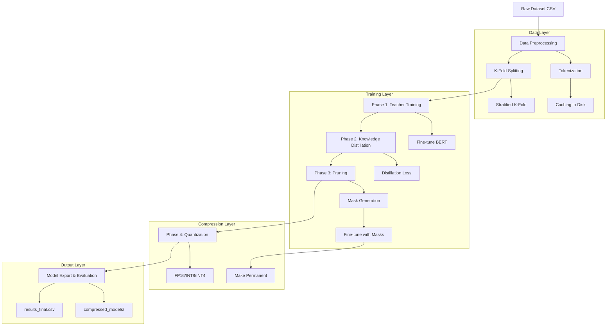
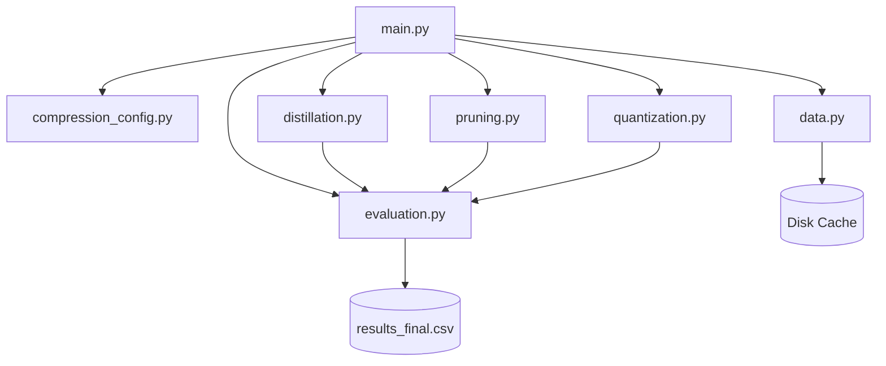

# Technical Documentation: KD-Pruning-Quantization Framework

## Table of Contents
1. [System Overview](#1-system-overview)
2. [Architecture Pipeline](#2-architecture-pipeline)
3. [Phase 1: Teacher Training](#3-phase-1-teacher-training)
4. [Phase 2: Knowledge Distillation](#4-phase-2-knowledge-distillation)
5. [Phase 3: Pruning](#5-phase-3-pruning)
6. [Phase 4: Quantization](#6-phase-4-quantization)
7. [Data Processing](#7-data-processing)
8. [Evaluation & Metrics](#8-evaluation--metrics)
9. [Code Architecture](#9-code-architecture)
10. [Configuration System](#10-configuration-system)
11. [Reproducibility & Logging](#11-reproducibility--logging)
12. [Performance Optimization](#12-performance-optimization)

---

## 1. System Overview

### 1.1 Purpose
This framework implements a production-ready compression pipeline for Transformer-based NLP models, achieving **10-30x compression** with minimal accuracy degradation. It's specifically optimized for:
- Low-resource languages (Bengali, Hindi, etc.)
- Edge deployment (mobile, IoT)
- Resource-constrained environments (limited GPU/CPU)

### 1.2 Compression Techniques
The pipeline combines three orthogonal compression methods:

| Technique | Compression | Accuracy Impact | Hardware Benefit |
|:----------|:------------|:----------------|:-----------------|
| **Knowledge Distillation** | 2-4x | Minimal (teacher guidance) | Faster inference |
| **Pruning** | 1.5-3x | Low (with fine-tuning) | Reduced FLOPs |
| **Quantization** | 2-8x | Very Low (FP16/INT8) | Memory bandwidth |
| **Combined** | **10-30x** | **5-15% F1 drop** | **All benefits** |

### 1.3 Design Principles
- **Modularity**: Each phase is independent and can be run standalone
- **Reproducibility**: All hyperparameters logged to output metrics
- **Extensibility**: Easy to add new pruning/quantization methods
- **Production-Ready**: Includes model export, size tracking, and inference benchmarking

---

## 2. Architecture Pipeline

### 2.1 High-Level Flow


### 2.2 Execution Modes
The framework supports multiple pipeline configurations:

| Pipeline | Phases Executed | Use Case |
|:---------|:----------------|:---------|
| `teacher_only` | 1 | Baseline training |
| `kd_only` | 1 → 2 | Distillation experiments |
| `kd_prune` | 1 → 2 → 3 | Distillation + Sparsity |
| `kd_prune_quant` | 1 → 2 → 3 → 4 | **Full compression** |

---

## 3. Phase 1: Teacher Training

### 3.1 Objective
Train a large, high-capacity model to serve as the "knowledge source" for distillation.

### 3.2 Model Architecture
```python
TeacherModel:
  ├── encoder: AutoModel (e.g., BanglaBERT)
  │   ├── 12 Transformer layers
  │   ├── 768 hidden dimensions
  │   └── ~110M parameters
  └── classifier: Sequential
      ├── Dropout(0.1)
      └── Linear(768 → num_labels)
```

### 3.3 Training Details

#### Loss Function
```
L_teacher = CrossEntropyLoss(logits, hard_labels)
```

#### Optimizer Configuration
```python
AdamW:
  - lr: 2e-5 (default)
  - weight_decay: 0.01
  - betas: (0.9, 0.999)
  - eps: 1e-8
```

#### Learning Rate Schedule
```python
get_linear_schedule_with_warmup:
  - warmup_steps: 10% of total steps
  - decay: Linear to 0
```

#### Gradient Clipping
```python
torch.nn.utils.clip_grad_norm_(
    model.parameters(), 
    max_norm=1.0
)
```

### 3.4 Early Stopping
- **Metric**: Validation F1 (macro)
- **Patience**: 3 epochs
- **Restoration**: Best checkpoint loaded after training

### 3.5 Output Artifacts
```
models/<experiment>/
├── teacher_model.pt          # Full model state
├── teacher_encoder/          # HuggingFace format
│   ├── config.json
│   ├── pytorch_model.bin
│   └── tokenizer files
└── teacher_classifier.pt     # Classification head
```

---

## 4. Phase 2: Knowledge Distillation

### 4.1 Objective
Transfer knowledge from the large teacher to a smaller student model using soft targets.

### 4.2 Student Architecture
```python
StudentModel:
  ├── encoder: AutoModel (e.g., DistilBERT)
  │   ├── 6 Transformer layers (vs 12)
  │   ├── 768 hidden dimensions
  │   └── ~66M parameters (vs 110M)
  └── classifier: Sequential
      ├── Dropout(0.1)
      └── Linear(768 → num_labels)
```

### 4.3 Distillation Loss

#### Mathematical Formulation
```
L_total = α * L_CE + (1 - α) * L_KD

where:
  L_CE = CrossEntropy(student_logits, hard_labels)
  L_KD = KLDivergence(
      softmax(student_logits / T),
      softmax(teacher_logits / T)
  ) * T²
```

#### Hyperparameters
- **Temperature (T)**: 4.0 (default)
  - Higher T → softer distributions → more inter-class info
  - Lower T → sharper distributions → closer to hard labels
- **Alpha (α)**: 0.5 (default)
  - 0.0 → Pure distillation
  - 1.0 → Pure supervised learning
  - 0.5 → Balanced

#### Implementation
```python
def distillation_loss(student_logits, teacher_logits, labels, T, alpha):
    # Hard loss
    loss_ce = F.cross_entropy(student_logits, labels)
    
    # Soft loss
    student_soft = F.log_softmax(student_logits / T, dim=-1)
    teacher_soft = F.softmax(teacher_logits / T, dim=-1)
    loss_kd = F.kl_div(student_soft, teacher_soft, reduction='batchmean') * (T ** 2)
    
    return alpha * loss_ce + (1 - alpha) * loss_kd
```

### 4.4 Training Strategy

#### Dual Tokenization
When teacher and student use different tokenizers:
```python
batch = {
    'input_ids': teacher_tokens,           # For teacher forward pass
    'attention_mask': teacher_mask,
    'student_input_ids': student_tokens,   # For student forward pass
    'student_attention_mask': student_mask,
    'labels': ground_truth
}
```

#### Forward Pass
```python
# Teacher inference (no gradients)
with torch.no_grad():
    teacher_logits = teacher(input_ids, attention_mask)

# Student training
student_logits = student(student_input_ids, student_attention_mask)
loss = distillation_loss(student_logits, teacher_logits, labels, T, alpha)
```

### 4.5 Output Artifacts
```
models/<experiment>/
├── student_model.pt
├── student_encoder/
└── student_classifier.pt
```

---

## 5. Phase 3: Pruning

### 5.1 Objective
Induce structured or unstructured sparsity by removing redundant weights.

### 5.2 Pruning Methods

#### 5.2.1 Magnitude Pruning
**Algorithm**: Remove weights with smallest absolute values.

```python
def compute_magnitude_mask(weight, sparsity):
    # Flatten weight tensor
    importance = weight.abs().flatten()
    
    # Compute threshold (k-th smallest value)
    k = int(sparsity * importance.numel())
    threshold = torch.kthvalue(importance, k).values
    
    # Create binary mask
    mask = (weight.abs() >= threshold).float()
    return mask
```

**Pros**:
- Simple and fast
- Works well for moderate sparsity (30-50%)

**Cons**:
- Doesn't consider activation patterns
- May remove important weights in critical layers

#### 5.2.2 Wanda Pruning
**Algorithm**: Prune by Weights AND activations (Wanda, 2023).

```python
def compute_wanda_mask(weight, input_activations, sparsity):
    # Compute importance score
    # S_ij = |W_ij| * ||X_j||_2
    activation_norms = input_activations.norm(dim=0)  # L2 norm per input feature
    importance = weight.abs() * activation_norms.unsqueeze(0)
    
    # Threshold and mask
    k = int(sparsity * importance.numel())
    threshold = torch.kthvalue(importance.flatten(), k).values
    mask = (importance >= threshold).float()
    return mask
```

**Pros**:
- Considers input sensitivity
- Better accuracy at high sparsity (50-70%)

**Cons**:
- Requires calibration data
- Slightly slower

### 5.3 Pruning Workflow

#### Step 1: Mask Generation
```python
pruner = PruningManager(model, method='magnitude', sparsity=0.4)
pruner.apply_pruning()  # Creates masks, doesn't modify weights yet
```

Internally:
```python
for name, module in model.named_modules():
    if isinstance(module, nn.Linear):
        mask = compute_mask(module.weight, sparsity)
        # Register mask as buffer (not a parameter)
        module.register_buffer(f'{name}_mask', mask)
        # Apply mask via hook
        module.register_forward_pre_hook(apply_mask_hook)
```

#### Step 2: Fine-Tuning with Masks
**Critical**: The model is trained with masks **active** but not permanent.
```python
# During fine-tuning, effective weight = W * M
def forward_with_mask(module, input):
    effective_weight = module.weight * module.weight_mask
    return F.linear(input, effective_weight, module.bias)
```

This allows the model to:
- Adjust non-pruned weights to compensate
- Recover accuracy lost from pruning

#### Step 3: Make Pruning Permanent
**After** fine-tuning completes:
```python
pruner.make_pruning_permanent()
```

Implementation:
```python
def make_pruning_permanent(self):
    for module in self.prunable_modules:
        # Physically set pruned weights to 0
        module.weight.data *= module.weight_mask
        # Remove mask buffer
        delattr(module, 'weight_mask')
        # Remove hook
        module._forward_pre_hooks.clear()
```

### 5.4 Sparsity Verification
```python
def calculate_sparsity(model):
    total = 0
    zeros = 0
    for param in model.parameters():
        total += param.numel()
        zeros += (param == 0).sum().item()
    return zeros / total
```

### 5.5 Output Artifacts
```
models/<experiment>/
├── pruned_model.pt          # Sparse model
└── pruning_stats.json       # Sparsity per layer
```

---

## 6. Phase 4: Quantization

### 6.1 Objective
Reduce numerical precision to decrease model size and increase inference speed.

### 6.2 Quantization Methods

#### 6.2.1 FP16 (Half Precision)
**Target**: GPU (Tensor Cores)

```python
model_fp16 = model.half()  # Convert all parameters to float16
```

**Characteristics**:
- **Compression**: 2x
- **Accuracy**: No loss (sufficient precision for inference)
- **Speed**: 2-3x faster on modern GPUs (A100, V100, T4)

#### 6.2.2 Dynamic INT8 Quantization
**Target**: CPU

```python
model_int8 = torch.quantization.quantize_dynamic(
    model,
    {torch.nn.Linear},  # Quantize Linear layers only
    dtype=torch.qint8
)
```

**How it works**:
1. **Weights**: Stored as INT8 (offline conversion)
   ```
   W_int8 = round(W_fp32 / scale) + zero_point
   ```
2. **Activations**: Quantized dynamically during forward pass
3. **Computation**: INT8 matrix multiplication, then dequantize

**Characteristics**:
- **Compression**: 4x
- **Accuracy**: ~1-2% F1 drop
- **Speed**: 2-4x faster on CPU (AVX2/AVX512)

#### 6.2.3 Static INT8 Quantization
**Target**: CPU/Edge devices

**Calibration Process**:
```python
# Step 1: Prepare model
model.qconfig = torch.quantization.get_default_qconfig('fbgemm')
model_prepared = torch.quantization.prepare(model)

# Step 2: Calibrate (collect activation statistics)
with torch.no_grad():
    for batch in calibration_loader:
        model_prepared(batch['input_ids'], batch['attention_mask'])

# Step 3: Convert
model_int8 = torch.quantization.convert(model_prepared)
```

**Characteristics**:
- **Compression**: 4x
- **Accuracy**: ~2-3% F1 drop (better than dynamic with calibration)
- **Speed**: 3-5x faster on CPU

#### 6.2.4 INT4 Quantization (NF4)
**Target**: GPU (via `bitsandbytes`)

**Algorithm**: Normal Float 4-bit (NF4)
```python
from transformers import BitsAndBytesConfig

config = BitsAndBytesConfig(
    load_in_4bit=True,
    bnb_4bit_quant_type="nf4",           # Normal Float 4
    bnb_4bit_compute_dtype=torch.float16, # Compute in FP16
    bnb_4bit_use_double_quant=True       # Nested quantization
)

model_int4 = StudentModel.from_pretrained(
    model_path,
    quantization_config=config
)
```

**How NF4 works**:
1. Assumes weights follow normal distribution
2. Quantizes to 16 levels optimally spaced for N(0,1)
3. Nested quantization: quantize the quantization constants themselves

**Characteristics**:
- **Compression**: 8x
- **Accuracy**: ~3-5% F1 drop
- **Speed**: Varies (depends on kernel implementation)

### 6.3 Size Calculation
```python
def get_model_size(model):
    total_size = 0
    for param in model.parameters():
        # Size in bytes
        param_size = param.numel() * param.element_size()
        total_size += param_size
    return total_size / (1024 ** 2)  # Convert to MB
```

### 6.4 Output Artifacts
```
compressed_models/<name>/
├── model_fp16.pt
├── model_int8.pt
├── model_int4/              # HF format for INT4
└── size_comparison.json
```

---

## 7. Data Processing

### 7.1 Dataset Format
**Input CSV**:
```csv
text,label
"আপনি একজন বোকা",1
"আপনি ভালো মানুষ",0
```

### 7.2 Tokenization Pipeline
```python
def tokenize_function(examples):
    return tokenizer(
        examples['text'],
        padding='max_length',
        truncation=True,
        max_length=128,
        return_tensors='pt'
    )
```

**Caching**:
```python
cache_path = f"data/tokenized_{dataset_name}_{model_name}.arrow"
if os.path.exists(cache_path):
    dataset = load_from_disk(cache_path)
else:
    dataset = dataset.map(tokenize_function, batched=True)
    dataset.save_to_disk(cache_path)
```

### 7.3 K-Fold Cross-Validation
**Stratified Splitting** (preserves label distribution):
```python
from iterstrat.ml_stratifiers import MultilabelStratifiedKFold

skf = MultilabelStratifiedKFold(n_splits=5, shuffle=True, random_state=42)
for fold, (train_idx, val_idx) in enumerate(skf.split(X, y)):
    yield train_idx, val_idx
```

### 7.4 Data Loaders
```python
train_loader = DataLoader(
    train_dataset,
    batch_size=32,
    shuffle=True,
    num_workers=2,
    pin_memory=True  # Faster GPU transfer
)
```

---

## 8. Evaluation & Metrics

### 8.1 Metrics Tracked

#### Classification Metrics
```python
@dataclass
class CompressionStageMetrics:
    # Performance
    accuracy_exact: float          # Exact match accuracy
    f1_macro: float                # Macro F1 (primary metric)
    f1_weighted: float
    precision_macro: float
    recall_macro: float
    
    # Per-label metrics
    per_label_f1: Dict[str, float]
    per_label_precision: Dict[str, float]
    per_label_recall: Dict[str, float]
    
    # Model characteristics
    model_size_mb: float
    num_parameters: int
    sparsity_percent: float
    
    # Inference performance
    latency_ms: float              # Per-sample latency
    throughput_samples_per_sec: float
    
    # Compression ratios
    compression_ratio: float       # vs original
    speedup_ratio: float           # vs original
    
    # Training metadata
    best_epoch: int
    train_loss: float
    val_loss: float
    
    # Configuration (NEW!)
    config: Dict                   # All CLI arguments
```

#### Metric Calculation
```python
def evaluate_model(model, dataloader, device):
    all_preds = []
    all_labels = []
    
    model.eval()
    with torch.no_grad():
        for batch in dataloader:
            logits = model(batch['input_ids'].to(device))
            preds = torch.argmax(logits, dim=-1)
            all_preds.extend(preds.cpu().numpy())
            all_labels.extend(batch['labels'].numpy())
    
    # Compute metrics
    f1_macro = f1_score(all_labels, all_preds, average='macro')
    precision = precision_score(all_labels, all_preds, average='macro')
    recall = recall_score(all_labels, all_preds, average='macro')
    
    return {
        'f1_macro': f1_macro,
        'precision': precision,
        'recall': recall
    }
```

### 8.2 Threshold Exploration
For imbalanced datasets, find optimal classification threshold:
```python
def find_best_threshold(logits, labels, thresholds=[0.3, 0.4, 0.5, 0.6, 0.7]):
    best_f1 = 0
    best_threshold = 0.5
    
    probs = torch.softmax(logits, dim=-1)[:, 1]  # Probability of positive class
    
    for threshold in thresholds:
        preds = (probs >= threshold).long()
        f1 = f1_score(labels, preds, average='macro')
        if f1 > best_f1:
            best_f1 = f1
            best_threshold = threshold
    
    return best_threshold, best_f1
```

### 8.3 Output Format

#### CSV Export
```csv
stage,size_mb,params_M,sparsity_%,f1_macro,latency_ms,arg_prune_sparsity,arg_quant_method
teacher_baseline,420.5,110.2,0.0,0.8234,12.3,,,
after_kd,252.3,66.1,0.0,0.8012,7.8,,,
after_pruning,151.4,66.1,0.4,0.7891,5.2,0.4,
after_quantization,37.8,66.1,0.4,0.7856,2.1,0.4,fp16
```

#### JSON Export
```json
{
  "teacher_baseline": {
    "f1_macro": 0.8234,
    "model_size_mb": 420.5,
    "config": {
      "teacher_path": "csebuetnlp/banglabert",
      "teacher_epochs": 5
    }
  },
  "after_quantization": {
    "f1_macro": 0.7856,
    "model_size_mb": 37.8,
    "compression_ratio": 11.13,
    "config": {
      "prune_sparsity": 0.4,
      "quant_method": "fp16"
    }
  }
}
```

---

## 9. Code Architecture

### 9.1 Module Dependency Graph


### 9.2 Class Hierarchy

#### Distillation Module
```python
class TeacherModel(nn.Module):
    def __init__(self, model_name, num_labels)
    def forward(self, input_ids, attention_mask)
    def save_pretrained(self, path)
    @classmethod
    def from_pretrained(cls, path)

class StudentModel(nn.Module):
    # Same interface as TeacherModel
    
class DistillationTrainer:
    def __init__(self, teacher, student, train_loader, val_loader)
    def train_epoch(self)
    def evaluate(self)
    def train(self, num_epochs)
```

#### Pruning Module
```python
class PruningManager:
    def __init__(self, model, method, sparsity)
    def apply_pruning(self)
    def fine_tune(self, train_loader, val_loader, epochs)
    def make_pruning_permanent(self)
    def calculate_sparsity(self)

class MagnitudePruner(PruningManager):
    def compute_mask(self, weight)

class WandaPruner(PruningManager):
    def compute_mask(self, weight, activations)
```

#### Quantization Module
```python
class QuantizationManager:
    def __init__(self, model, method, dtype)
    def quantize(self)
    def get_model_size(self, model)
    def compare_sizes(self)
    def benchmark_inference(self, dataloader)
```

### 9.3 File Structure
```
kd_pruning_quantization_framework_for_nlp/
├── main.py                      # Entry point & orchestration
├── compression_config.py        # Argument parsing
├── distillation.py              # KD logic
├── pruning.py                   # Pruning algorithms
├── quantization.py              # Quantization methods
├── data.py                      # Data loading & preprocessing
├── evaluation.py                # Metrics & evaluation
├── test_compression.py          # Unit tests
├── README.md                    # User documentation
├── TECHNICAL_DOCS.md            # This file
├── run_combinations.md          # Example commands
├── data/
│   ├── HateSpeech.csv
│   └── tokenized_*.arrow        # Cached tokenized data
├── models/
│   └── <experiment_name>/
│       ├── teacher_model.pt
│       ├── student_model.pt
│       └── pruned_model.pt
└── compressed_models/
    └── <name>/
        ├── model_fp16.pt
        └── model_int8.pt
```

---

## 10. Configuration System

### 10.1 Command-Line Arguments

#### Pipeline Control
```bash
--pipeline {teacher_only,kd_only,kd_prune,kd_prune_quant}
--dataset_path PATH
--author_name STR
--experiment_name STR
```

#### Model Selection
```bash
--teacher_path MODEL_NAME        # e.g., "csebuetnlp/banglabert"
--student_path MODEL_NAME        # e.g., "distilbert-base-multilingual-cased"
```

#### Training Hyperparameters
```bash
--teacher_epochs INT             # Default: 5
--epochs INT                     # KD epochs, Default: 10
--fine_tune_epochs INT           # Post-pruning, Default: 3
--batch INT                      # Batch size, Default: 32
--lr FLOAT                       # Learning rate, Default: 2e-5
--weight_decay FLOAT             # Default: 0.01
--gradient_clip_norm FLOAT       # Default: 1.0
```

#### Distillation Parameters
```bash
--temperature FLOAT              # Default: 4.0
--alpha FLOAT                    # Default: 0.5
```

#### Pruning Configuration
```bash
--prune_method {magnitude,wanda}
--prune_sparsity FLOAT           # 0.0-1.0, Default: 0.4
--prune_layers {all,attention,ffn}
```

#### Quantization Configuration
```bash
--quant_method {fp16,dynamic,static,int4}
--quant_dtype {int8,int4}
--quant_calibration_batches INT  # For static quantization
```

#### Data Processing
```bash
--data_fraction FLOAT            # Use subset, Default: 1.0
--n_folds INT                    # K-fold CV, Default: 5
--max_length INT                 # Token length, Default: 128
```

### 10.2 Configuration Validation
```python
def validate_config(config):
    assert 0 < config.prune_sparsity < 1, "Sparsity must be in (0, 1)"
    assert config.temperature > 0, "Temperature must be positive"
    assert 0 <= config.alpha <= 1, "Alpha must be in [0, 1]"
    
    if config.quant_method == 'int4':
        try:
            import bitsandbytes
        except ImportError:
            raise ImportError("INT4 requires bitsandbytes")
```

---

## 11. Reproducibility & Logging

### 11.1 Random Seed Control
```python
def set_seed(seed=42):
    random.seed(seed)
    np.random.seed(seed)
    torch.manual_seed(seed)
    torch.cuda.manual_seed_all(seed)
    torch.backends.cudnn.deterministic = True
    torch.backends.cudnn.benchmark = False
```

### 11.2 Argument Logging
All CLI arguments are saved to metrics:
```python
config_dict = vars(config)  # Convert Namespace to dict
metrics = CompressionStageMetrics(
    ...,
    config=config_dict
)
```

In CSV output:
```csv
arg_prune_sparsity,arg_quant_method,arg_lr,arg_batch
0.4,fp16,2e-5,32
```

### 11.3 Experiment Tracking
```python
experiment_dir = f"models/{config.experiment_name}_{timestamp}/"
os.makedirs(experiment_dir, exist_ok=True)

# Save config
with open(f"{experiment_dir}/config.json", 'w') as f:
    json.dump(vars(config), f, indent=2)
```

---

## 12. Performance Optimization

### 12.1 Memory Management

#### Gradient Accumulation
For large models with limited GPU memory:
```python
accumulation_steps = 4
optimizer.zero_grad()

for i, batch in enumerate(train_loader):
    loss = model(batch) / accumulation_steps
    loss.backward()
    
    if (i + 1) % accumulation_steps == 0:
        optimizer.step()
        optimizer.zero_grad()
```

#### Mixed Precision Training
```python
from torch.cuda.amp import autocast, GradScaler

scaler = GradScaler()

for batch in train_loader:
    with autocast():
        loss = model(batch)
    
    scaler.scale(loss).backward()
    scaler.step(optimizer)
    scaler.update()
```

### 12.2 Inference Optimization

#### Batch Inference
```python
def batch_predict(model, texts, batch_size=32):
    predictions = []
    for i in range(0, len(texts), batch_size):
        batch = texts[i:i+batch_size]
        inputs = tokenizer(batch, padding=True, return_tensors='pt')
        with torch.no_grad():
            logits = model(**inputs)
        preds = torch.argmax(logits, dim=-1)
        predictions.extend(preds.cpu().numpy())
    return predictions
```

#### ONNX Export (Future)
```python
torch.onnx.export(
    model,
    dummy_input,
    "model.onnx",
    opset_version=14,
    input_names=['input_ids', 'attention_mask'],
    output_names=['logits'],
    dynamic_axes={'input_ids': {0: 'batch'}}
)
```

### 12.3 Benchmarking
```python
def benchmark_latency(model, dataloader, device, num_runs=100):
    model.eval()
    latencies = []
    
    with torch.no_grad():
        for i, batch in enumerate(dataloader):
            if i >= num_runs:
                break
            
            start = time.time()
            _ = model(batch['input_ids'].to(device))
            torch.cuda.synchronize()  # Wait for GPU
            end = time.time()
            
            latencies.append((end - start) * 1000)  # Convert to ms
    
    return {
        'mean_latency_ms': np.mean(latencies),
        'p50_latency_ms': np.percentile(latencies, 50),
        'p95_latency_ms': np.percentile(latencies, 95),
        'p99_latency_ms': np.percentile(latencies, 99)
    }
```

---

## Appendix A: Mathematical Foundations

### A.1 Knowledge Distillation Loss Derivation
Given:
- Student logits: $z_s \in \mathbb{R}^C$
- Teacher logits: $z_t \in \mathbb{R}^C$
- Temperature: $T$

Soft targets:
$$p_t^i = \frac{\exp(z_t^i / T)}{\sum_j \exp(z_t^j / T)}$$

KL Divergence:
$$\mathcal{L}_{KD} = T^2 \sum_i p_t^i \log \frac{p_t^i}{p_s^i}$$

The $T^2$ factor ensures gradients have appropriate magnitude.

### A.2 Pruning Sparsity Calculation
For a layer with weight matrix $W \in \mathbb{R}^{m \times n}$:

$$\text{Sparsity} = \frac{|\{w_{ij} : w_{ij} = 0\}|}{m \times n}$$

Global sparsity across all layers:
$$\text{Global Sparsity} = \frac{\sum_l |\{w : w = 0\}_l|}{\sum_l |W_l|}$$

### A.3 Quantization Error
For symmetric quantization:
$$\hat{w} = \text{round}\left(\frac{w}{s}\right) \cdot s$$

where scale $s = \frac{\max(|w|)}{2^{b-1} - 1}$ for $b$-bit quantization.

Quantization error:
$$\epsilon = \mathbb{E}[(w - \hat{w})^2]$$

---

## Appendix B: Troubleshooting

### B.1 Common Issues

#### CUDA Out of Memory
**Solution**: Reduce batch size or use gradient accumulation
```bash
--batch 16  # Instead of 32
```

#### Sparsity Loss After Fine-tuning
**Solution**: Ensure `make_pruning_permanent()` is called AFTER fine-tuning (already fixed in current version)

#### INT4 Import Error
**Solution**: Install bitsandbytes
```bash
pip install bitsandbytes accelerate
```

#### Poor Distillation Performance
**Solution**: 
- Increase temperature (try 6.0 or 8.0)
- Adjust alpha (try 0.3 for more teacher influence)
- Ensure teacher is well-trained

### B.2 Performance Debugging
```python
# Profile memory usage
import torch.cuda

print(f"Allocated: {torch.cuda.memory_allocated() / 1e9:.2f} GB")
print(f"Reserved: {torch.cuda.memory_reserved() / 1e9:.2f} GB")

# Profile time
import cProfile
cProfile.run('train_epoch()', 'profile_stats')
```

---

## Appendix C: References

1. **Knowledge Distillation**: Hinton et al., "Distilling the Knowledge in a Neural Network" (2015)
2. **Magnitude Pruning**: Han et al., "Learning both Weights and Connections for Efficient Neural Networks" (2015)
3. **Wanda Pruning**: Sun et al., "A Simple and Effective Pruning Approach for Large Language Models" (2023)
4. **Quantization**: Jacob et al., "Quantization and Training of Neural Networks for Efficient Integer-Arithmetic-Only Inference" (2018)
5. **INT4/NF4**: Dettmers et al., "QLoRA: Efficient Finetuning of Quantized LLMs" (2023)

---

**Document Version**: 2.0  
**Last Updated**: 2026-01-07  
**Framework Version**: 1.0
